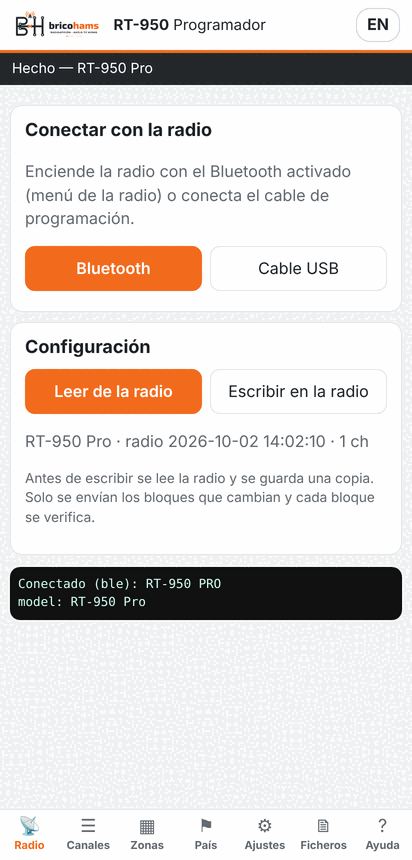
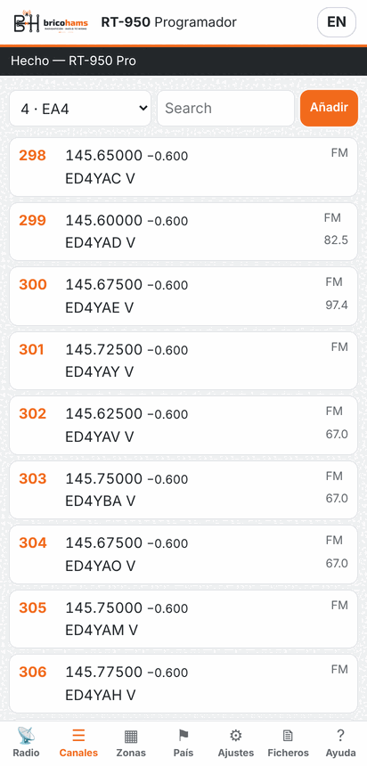
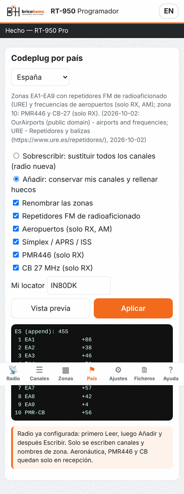
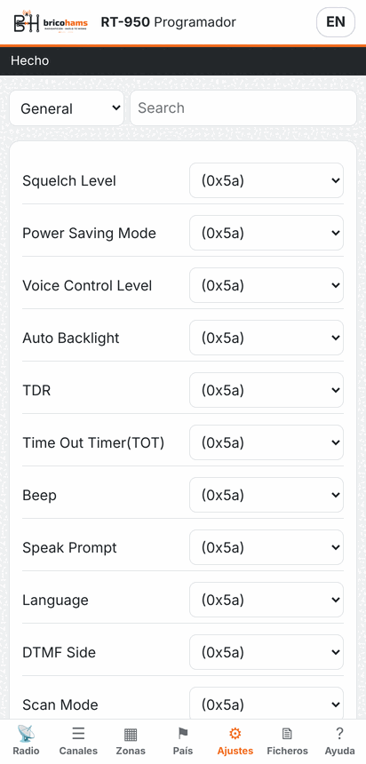

# BricoHams RT-950 Programmer — Android and web

*[Versión en español](README.md)*

Programmer for the Radtel RT-950 / RT-950 Pro **over Bluetooth** from the
phone, with the same operations as the Windows and Linux application. The
same code runs as an **Android APK** and as a **web page** (Chrome on
Android, Windows, Linux or macOS).

| Radio | Channels | Country | Settings |
|---|---|---|---|
|  |  |  |  |

## Install

| Option | How |
|---|---|
| APK | Download `BricoHams-RT950-Programmer-x.y.z.apk` from the latest release, open it on the phone and allow "install unknown apps" for the browser or file manager. Android 7 or later with Bluetooth LE. |
| Web | Open `https://anatolbricoham.github.io/rt950pro-satellite-mode/app/` in Chrome. On Android you can use "Add to Home screen". |

The APK is signed with the BricoHams key (`es.bricohams.rt950`); updates
install over it as long as the signature stays the same.

## What it does

| Function | Details |
|---|---|
| Connect | **Bluetooth** (the radio's BLE module) or **USB cable** (Web Serial, in desktop Chrome/Edge). |
| Read | The whole configuration. A backup is kept automatically under **Files → Backups**. |
| Channels | List per zone, search by name, frequency, tone or mode; editor with RX/TX, CTCSS/DCS tones, power, bandwidth, FM/AM, TX enable, scan, busy lock and PTT-ID; add and delete. |
| Zones | Names of the 10 zones. |
| Country | Spain and United Kingdom codeplugs, overwrite or add, locator, preview. |
| Settings | Every select and text setting of the model file (general, keys, DTMF, FM/AM/SSB, APRS), with search. |
| Write | Reads the radio again (`before-write` backup), sends **only the blocks that changed** and verifies each one. A codeplug made from scratch only writes channels and zone names. |
| Files | Open and save `.rt950` (the same as the desktop Toolkit), export CHIRP CSV; the APK shares files through the Android share menu. |
| Help | Guide, backups, disclaimer (which must be accepted before writing). |

**Firmware** updates are not done over Bluetooth: use the desktop Toolkit or
the [web flasher](../firmware-flashing/README.en.md) with the cable.

## Use

1. Enable Bluetooth in the radio menu.
2. **Radio** tab → **Bluetooth** and pick the radio (it shows up as RT-950,
   Radtel or walkie-talkie). On Android accept the "Nearby devices"
   permission.
3. **Read from radio**, edit or load a country codeplug, and **Write to
   radio**.

A full read over Bluetooth takes longer than over the cable (about 300
128-byte blocks); the differential write only sends what changed.

## How it works

- `mobile/www/js/core.js`: channel, tone and settings encoding, `.rt950`
  file, programming protocol, country codeplugs and CSV. It is a translation
  of the Toolkit's Python code; field tables are exported from Python
  (`tools/export_web_meta.py`) and a test checks the result is **byte for
  byte identical** to Python's.
- `mobile/www/js/transport.js`: Bluetooth through Web Bluetooth or the native
  `@capacitor-community/bluetooth-le` plugin (APK), and the cable through Web
  Serial.
- Bluetooth protocol: the radio exposes service `0xFFE0` with characteristic
  `0xFFE1` (write + notify), which carries exactly the same frames as the
  cable. Before the handshake a 20-byte token (`????` 0x02 + 15 random bytes)
  must be written to `0xFF31`. Documented by the
  [rt950-ble](https://github.com/bartasx/Radtel-RT-950-PRO-bluetooth-reverse-engineering)
  project (bartasx, MIT); SP3ARK's app was the feature reference.
- `mobile/` is a [Capacitor](https://capacitorjs.com/) 8 project; GitHub
  Actions builds and signs the APK (`npm ci`, `npx cap sync android`,
  `./gradlew assembleRelease`).

## Build

```bash
cd mobile
npm ci
npx cap sync android
cd android && ./gradlew assembleDebug        # needs the Android SDK and JDK 21
```

Release signing: `BH_KEYSTORE`, `BH_KEYSTORE_PASSWORD`, `BH_KEY_ALIAS`
variables (see [signing and packages](../signing-and-packages/README.en.md)).

## Status

The core, the protocol and the user interface are tested with a radio
emulator (simulated Bluetooth in Chromium and a simulated native plugin in
Node). The APK is built by GitHub Actions; **it has not yet been tested with
a real radio over Bluetooth**.
