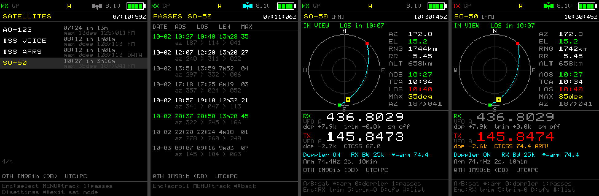
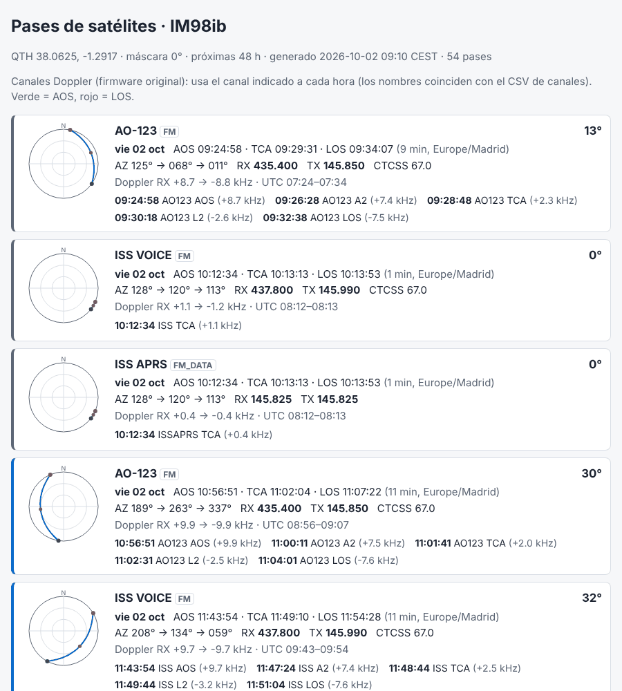

# Modo Satélite para Radtel RT-950 / RT-950 Pro

*[English version](README.en.md)*

Seguimiento de satélites de radioaficionado, con corrección Doppler, para el
RT-950 Pro. Funciona como la pantalla de satélites de **OpenGD77** y el modo
satélite de **AnyTone**: eliges un satélite, la radio calcula dónde está y
mantiene sintonizadas la bajada (RX) y la subida (TX) durante todo el pase.



*Pantallas generadas por el simulador de host a partir del código real del
firmware y de TLE reales del 1 de octubre de 2026, QTH IM98IB:
lista de satélites, pases de SO-50, seguimiento y transmisión con el tono de
armado de 74,4 Hz.*

## Hay dos formas de usarlo

| | **A. Firmware original de Radtel** | **B. Firmware custom con modo satélite** |
|---|---|---|
| Para quién | Cualquier RT-950 / 950 Pro, hoy mismo | Quien use el firmware abierto (alfa) |
| Qué hace la radio | Canales en modo split con escalones Doppler fijos (AOS, A2, TCA, L2, LOS) | Calcula la órbita con SGP4, mueve RX y TX cada segundo |
| Qué hace el PC | Genera los canales Doppler y el informe de pases (qué canal usar a qué hora) | Sube TLE, frecuencias, pases y hora UTC a la radio |
| Cómo se carga | **RT-950 Toolkit** añade los canales al codeplug y escribe la radio; o se abre el CSV en **RT-950/950Pro Editor** (KK4OXN) | Por el cable de programación (RT-950 Toolkit o `upload`) |
| Icono en la radio | — | Icono de satélite en la barra de estado |

Las dos vías comparten la misma herramienta de PC, la misma base de datos de
frecuencias (`pc/rt950_toolkit/data/sat_freqs.json`) y el mismo algoritmo de predicción.

## Qué incluye

**Firmware** (`src/app/sat_*.c`, `src/app/satellite.c`)

- Propagador SGP4 (near-Earth, WGS-72) de doble precisión con biblioteca
  matemática propia, porque el firmware enlaza con `-nostdlib`. Coincide con
  `python-sgp4` en menos de 2 µm.
- Ángulos de antena (AZ/EL), distancia, velocidad radial y Doppler. Frente a
  Skyfield, el error es de 0,003° y de 0,3 Hz a 437 MHz.
- Predictor de pases (AOS/TCA/LOS al segundo) que trabaja en segundo plano a
  trozos, sin bloquear la interfaz ni el watchdog.
- Operación en split: VFO A recibe la bajada y VFO B muestra y transmite la
  subida, con Doppler corregido. Por defecto el TX sale por el mismo chip que
  recibe (como OpenGD77); opcionalmente sale por el chip del VFO B (estilo
  AnyTone).
- Tono de armado de un solo uso (SO-50, 74,4 Hz), ajuste fino de RX con el
  encoder y Doppler activable o desactivable.
- Reloj UTC desde el GPS (RMC), desde el PC o manual. Posición desde el GPS o
  desde el QTH guardado en la base de datos (locator).
- Tres pantallas: lista ordenada por próximo AOS, seguimiento con gráfico
  polar y lista de pases.
- Icono de satélite en la barra de estado (gris: datos cargados; cian: modo
  satélite; verde parpadeando: satélite a la vista o aviso de AOS), aviso
  sonoro de AOS y categoría **Satellite** en el menú.
- Tres accesos: menú → Satellite → Sat Mode, pulsación larga de **D** o una
  tecla PF programada con la acción 8.

**Herramienta de PC**: pestaña **Satélites** de [RT-950 Toolkit](../toolkit/README.md) (Windows y Linux) y línea de comandos `tools/rt950_sat.py` (el código está en `pc/rt950_toolkit/sat.py`)

- Descarga de TLE (Celestrak amateur y stations, AMSAT) con caché y descarte
  de elementos caducados.
- Informe de pases en HTML (gráfico polar y tabla de cambio de canal), CSV e
  iCalendar con aviso 5 minutos antes.
- CSV de canales Doppler (formato CHIRP) para el firmware original.
- `satdb.bin` con TLE, frecuencias, pases y QTH, subida con verificación y
  puesta en hora de la radio.

## Inicio rápido

```bash
pip install sgp4 pyserial
cd tools

# Informe + CSV para el firmware original + satdb.bin (sin radio conectada)
python rt950_sat.py all --locator IM98IB

# Lo mismo y además subirlo a una radio con el firmware custom
python rt950_sat.py all --locator IM98IB --port COM5

# Interfaz gráfica: RT-950 Toolkit, pestaña Satélites
python ../pc/run_toolkit.py
```

La salida queda en `rt950_sat_out/`: `pases_satelites.html`,
`pases_satelites.csv`, `pases_satelites.ics`, `canales_satelite_chirp.csv`,
`satdb.bin` y `tle_cache.txt`.



## Documentación

| Documento | Contenido |
|---|---|
| [USER_GUIDE.md](USER_GUIDE.md) | Manual de uso: teclas, menús, pantallas, ejemplo con SO-50 y flujo con el firmware original y el Editor |
| [DESIGN_DECISIONS.md](DESIGN_DECISIONS.md) | Cada decisión técnica con su contexto, las alternativas y su justificación |
| [PROTOCOL_AND_FORMAT.md](PROTOCOL_AND_FORMAT.md) | Mapa de flash, formato binario `satdb.bin`, comandos CPS añadidos |
| [TESTING.md](TESTING.md) | Qué está verificado, cómo ejecutar las pruebas y el plan de pruebas sobre la radio |
| [../toolkit/README.md](../toolkit/README.md) | RT-950 Toolkit: editor de codeplug y herramienta de satélites para Windows y Linux |
| [../aprs-messaging/README.md](../aprs-messaging/README.md) | Mensajería APRS del firmware custom |

## Estado y límites

- El firmware custom de base está en **fase alfa**: arranque, LCD, teclado y
  audio verificados, y la mayoría de periféricos (BK4829, GPS, flash) todavía
  sin probar en hardware. El modo satélite compila sin avisos (`-Werror`) y
  está verificado en host con el código real, pero **no se ha probado en una
  radio**. Antes de transmitir, sigue el plan de [TESTING.md](TESTING.md) con
  carga artificial.
- El full-duplex real (oírse a uno mismo por el satélite) depende de la
  circuitería de antena y relés del RT-950 Pro y no está verificado. Por eso
  el modo por defecto es split en un solo chip.
- La radio solo transmite en FM. Los satélites lineales (RS-44, FO-29) se
  pueden seguir y escuchar como referencia, y la radio **nunca** transmite en
  un satélite marcado como lineal o solo-RX.
- La frecuencia de TX se calcula al pulsar PTT y se mantiene durante esa
  pasada (ver la decisión D-15).
- Las frecuencias y tonos de `sat_freqs.json` proceden de AMSAT, pero los
  transpondedores cambian de estado: compruébalos antes de cada sesión.

## Licencia

GPL-3.0, la misma licencia que el proyecto de firmware.
