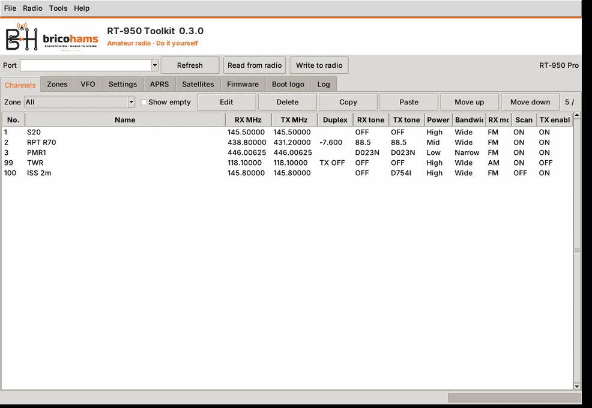
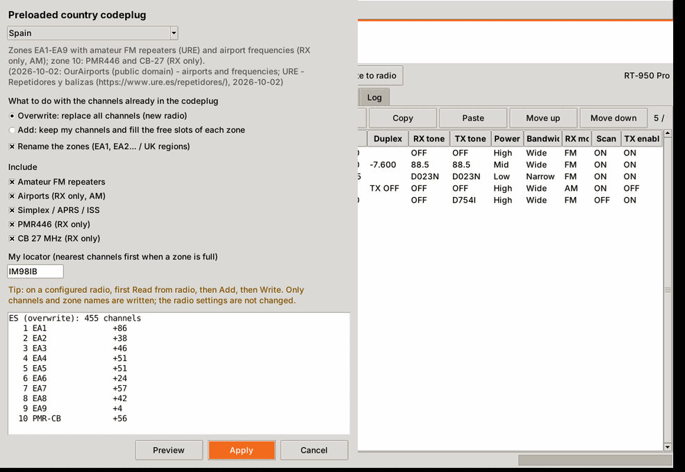
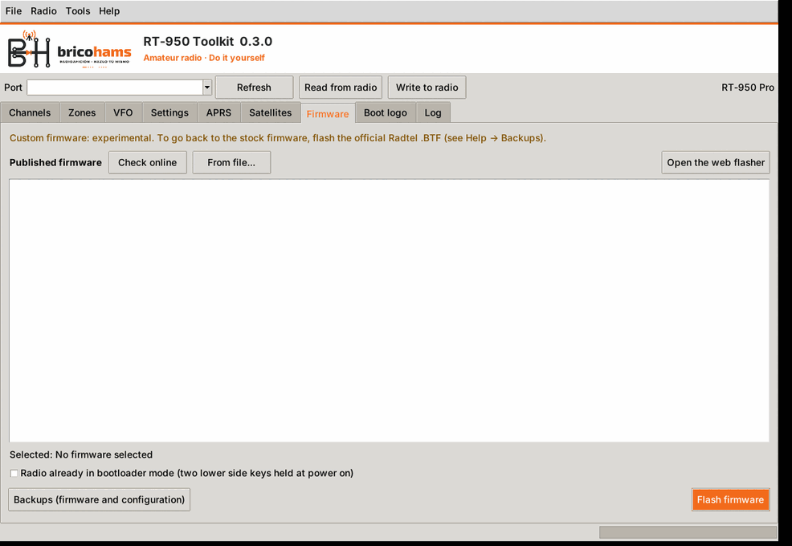
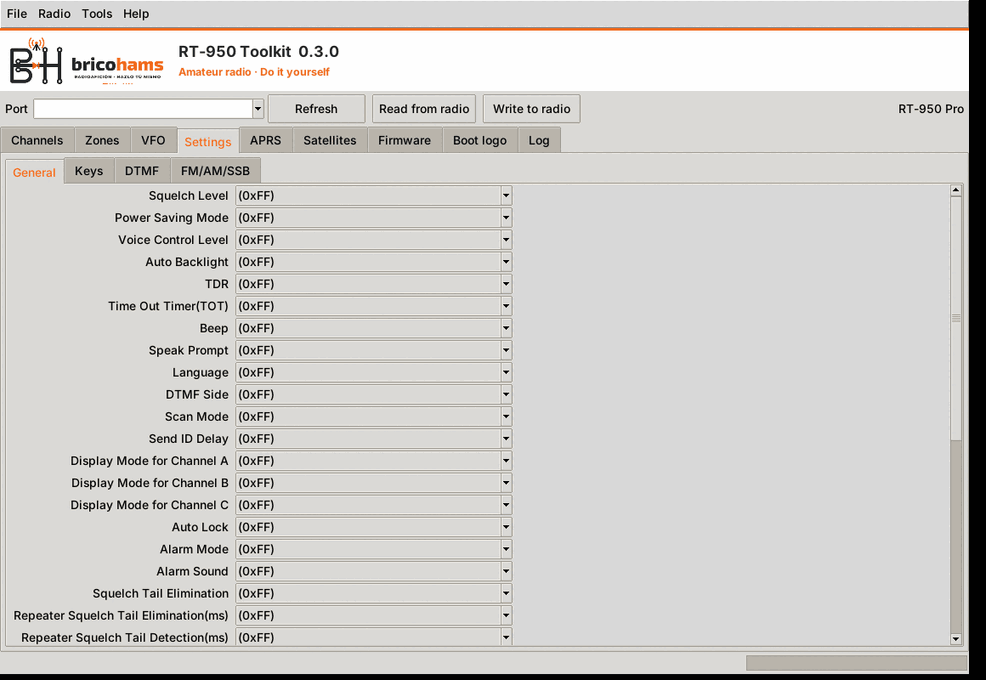
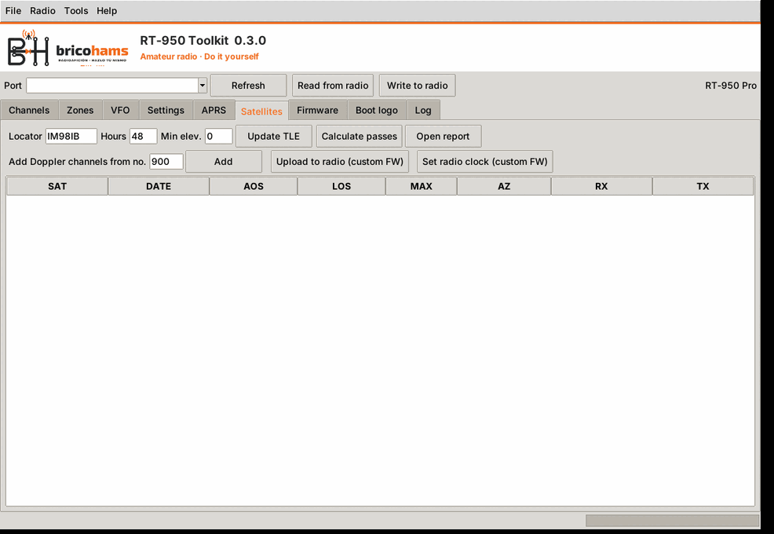

# BricoHams RT-950 Toolkit


*[Versión en español](README.md)*

Desktop and command-line application for **Windows and Linux** that programs
the Radtel **RT-950 / RT-950 Pro** over the programming cable. It works with
radios running the **stock Radtel firmware** and with radios running this
repository's **custom firmware**, and brings together in one program:

- the codeplug editor: channels, zones, VFO, settings, DTMF, FM/AM/SSB and
  APRS;
- the satellite tool: TLEs, passes, Doppler channels and loading the
  database into the radio;
- boot logo conversion and upload.



## Download and installation

### Installers and packages (recommended)

On the repository's **Releases** page and on the
[project web site](https://anatolbricoham.github.io/rt950pro-satellite-mode/):

| System | File | Installation |
|---|---|---|
| Windows 10/11 x64 | `BricoHams-RT950-Toolkit-Setup-x.y.z.exe` | Installer signed by BricoHams (see [signing and SmartScreen](../signing-and-packages/README.en.md)). A portable version is also available. |
| Debian / Ubuntu | `bricohams-rt950-toolkit_x.y.z_all.deb` | `sudo apt install ./bricohams-rt950-toolkit_x.y.z_all.deb` |
| Arch Linux | `bricohams-rt950-toolkit-x.y.z-1-any.pkg.tar.zst` | `sudo pacman -U bricohams-rt950-toolkit-*.pkg.tar.zst` |
| Other distributions | `BricoHams-RT950-Toolkit-x.y.z-linux-x64` | `chmod +x` and run |
| Android | `BricoHams-RT950-Programmer-x.y.z.apk` | See [Android app](../android/README.en.md) |

### From source

Requires Python 3.9 or later with Tkinter.

```bash
pip install -r pc/requirements.txt      # pyserial, sgp4 (+ pillow, optional)
python pc/run_toolkit.py                # desktop application
python pc/run_toolkit.py --help         # see also the CLI section
```

On Linux, some distributions ship Tkinter separately
(`sudo apt install python3-tk`) and the user needs access to the serial
port: `sudo usermod -aG dialout $USER`, then log in again.

### Cable

Use the radio's USB programming cable (Kenwood-type plug). On Windows,
install the driver for the cable's USB-serial converter; the port shows up as
`COMx`. On Linux it shows up as `/dev/ttyUSB0` or `/dev/ttyACM0`.

## What is new in 0.3.0

- **BricoHams branding** in the window, icon, installer, web site and the custom firmware boot screen.
- **Help** (F1): HTML manual in Spanish and English, backup guide and disclaimer (accepted on first use).
- **Country codeplugs** (Spain and United Kingdom): **Tools → Country codeplug…**, see [the documentation](../country-codeplugs/README.en.md).
- **Firmware**: **Firmware** tab to flash the published firmware or your own `.BTF`, and a [web flasher](../firmware-flashing/README.en.md).
- **Safe writes**: a codeplug that was not read from the radio only writes what was changed, merged with what the radio already holds.

| Country codeplug | Firmware |
|---|---|
|  |  |

## Basic use

1. Plug in the cable, switch the radio on and choose the **Port** (the
   **Refresh** button searches again).
2. **Read from radio.** The program detects whether the radio runs the stock
   or the custom firmware. When it finishes, it saves a backup.
3. Edit what you need in the tabs.
4. **Write to radio.** Before writing it reads the radio again and saves
   another backup. After writing it reads every block back and compares it
   (verify). If anything differs it reports the exact address.
5. Save your codeplug with **File → Save** (`.rt950` format).

Backups are kept in `%APPDATA%\BricoHamsRT950\backups` (Windows) or
`~/.config/BricoHamsRT950/backups` (Linux). **Radio → Restore a backup** writes
one of them to the radio.

The program only changes the bytes of the fields you edit. Everything else it
read from the radio (unknown bits, FHSS code, reserved bytes) is written back
unchanged.

## Tabs

| Tab | Contents |
|---|---|
| **Channels** | 990 channels in 10 zones of 99. Zone filter, show empty, edit (double-click), delete, copy/paste, move up/down. Dialog with name (GBK, 12 bytes), RX/TX, CTCSS/DCS tones (normal and inverted), power, bandwidth, RX mode (FM/AM), TX enable, scan add, busy lock, scrambler 1–8, DCP1–3 encryption, signal code 1–16 and PTT-ID. |
| **Zones** | Names of the 10 zones (16 bytes). |
| **VFO** | Frequency and offset of VFO A, B and C. The other VFO options are shown read-only (see D-34). |
| **Settings** | General, Keys, DTMF (radio ID and codes) and FM/AM/SSB (memories, names, SSB BFO offset). They come from the maker's model file: 131 select options, 58 text fields, 64 numeric values and 16 DTMF codes. |
| **APRS** | Call sign and SSID, paths, beacon message, symbol, timing, units, etc. |
| **Satellites** | Locator, hours and minimum elevation; **Update TLE**, **Calculate passes**, **Add Doppler channels** to the codeplug from the given number, **Open report** and, with the custom firmware, **Upload to radio** and **Set radio clock**. |
| **Firmware** | Flash the published firmware (SHA-256 checked) or your own `.BTF`; bootloader mode to recover a radio. |
| **Boot logo** | Converts an image to 240×320, exports it as BMP and, with the custom firmware, uploads it to the radio. |
| **Log** | Messages and errors of every operation. |



## Files

| File menu | Format | Notes |
|---|---|---|
| Open / Save | `.rt950` | Own format (JSON with the memory blocks in base64). Lossless. |
| Open / Save as CPS `.dat` | `.dat` | File of Radtel's official programming software. Saving uses an existing `.dat` as template (the one you opened or one you pick) and changes its fields. |
| Import / Export CSV (native) | CSV | One column per channel field. Lossless. |
| Import / Export CHIRP CSV | CSV | CHIRP and RepeaterBook exchange format. On import you can pick the first channel or use the `Location` column. |
| Import / Export RT-950 Editor CSV | CSV | `slot, rxFreq, txFreq, rxQT, …` columns of KK4OXN's Editor. Tested with its templates and `EU LPD and PMR Channels.csv`. |
| Import / Export zones CSV | CSV | `zone, zone_name`, as the Editor's template. |
| Import / Export FM/AM/SSB CSV | CSV | `index, label, fmFreq, fmName, amFreq, amName, ssbFreq, ssbBandwidth, ssbBeatFreqOffset, ssbName`. An empty cell changes nothing; `<blank>` clears the value. |
| Import / Export raw image | `.bin` | The blocks back to back, to compare with other tools. |

**Tools → Add stock channels**: PMR446 (RX only), IARU Region 1 simplex
(2 m and 70 cm), marine (RX only) and air band AM (RX only).

## Satellites

The **Satellites** tab does the same as `tools/rt950_sat.py` (the satellite
mode command-line tool):

- **Stock firmware**: predicts passes and adds split Doppler channels to the
  codeplug (AOS, A2, TCA, L2, LOS and, for SO-50, the arming channel). The
  HTML report tells you when to move to the next channel.
- **Custom firmware**: also uploads `satdb.bin` (TLEs, frequencies, passes
  and QTH) and sets the radio clock. The radio then computes the orbit and
  corrects the Doppler shift in real time.

See [the satellite mode documentation](../satellite/README.en.md).



## APRS

The APRS tab edits the beacon configuration. Two-way text messaging with
acknowledgements runs **in the custom firmware** (APRS Set menu → Messages); the
stock firmware only has the fixed beacon message. See
[APRS messaging](../aprs-messaging/README.en.md).

## Command line

```bash
RT950Toolkit                                    # desktop application
RT950Toolkit read  --port COM5 -o radio.rt950   # read (and save a backup)
RT950Toolkit write --port COM5 radio.rt950      # write (backup + verify)
RT950Toolkit write --port COM5 radio.rt950 --channels-only
RT950Toolkit info radio.rt950                   # channel summary
RT950Toolkit export-chirp radio.rt950 channels.csv
RT950Toolkit import-chirp radio.rt950 channels.csv --start 100 -o new.rt950
RT950Toolkit sat all --locator IM98IB [--port COM5]   # satellite tool
```

From source, `RT950Toolkit` is `python pc/run_toolkit.py`.

## Trying it without a radio

`pc/tests/oem_emulator.py` emulates the programming port of an RT-950 Pro
with stock firmware on a pseudo terminal (Linux only):

```bash
python pc/tests/oem_emulator.py
# Emulated RT-950 Pro on /dev/pts/5
```

Type that path into **Port** and read or write as with a real radio.

## Comparison with RT-950/950Pro Editor

| Editor function | RT-950 Toolkit |
|---|---|
| Read, write and verify over the cable | Yes (same block sequence; see [PROTOCOL.en.md](PROTOCOL.en.md)) |
| Channels, zones, VFO, settings, DTMF, FM/AM/SSB, APRS | Yes (VFO options read-only) |
| Open and save `.dat` | Yes (saving uses a `.dat` as template) |
| Channel, zone and FM/AM/SSB CSV | Yes, plus CHIRP and native CSV |
| Stock configurations | Yes (PMR446, IARU R1, marine, air band) |
| Backup | Yes, automatic before every write |
| Bluetooth (BLE) programming | No |
| RepeaterBook / RadioReference search | No (their CHIRP-format CSV can be imported) |
| Boot logo upload with the stock firmware | No (yes with the custom firmware) |
| Windows | Yes |
| Linux | Yes |
| Satellites (TLE, passes, Doppler, upload to the radio) | Yes |
| Custom firmware (A5 protocol) | Yes |

## Status

- The protocol and encodings were cross-checked against the Editor, which is
  proven on real radios, and against the maker's model file. The automated
  tests cover everything with a radio emulator, but **this program has not
  yet been tested with a physical radio**. Keep the backup it makes when
  reading and check the result.
- See [DESIGN_DECISIONS.en.md](../satellite/DESIGN_DECISIONS.en.md) (D-29 to
  D-38) and [TESTING.en.md](../satellite/TESTING.en.md).

## Credits

- **RT-950/950Pro Editor** by KK4OXN (MIT licence): reference used to verify
  the protocol, tone and text encodings, block plan and `.dat` format. None
  of its code was copied.
- Radtel's model file (`rt950pro_schema.json`) describes the addresses and
  options of the settings.
