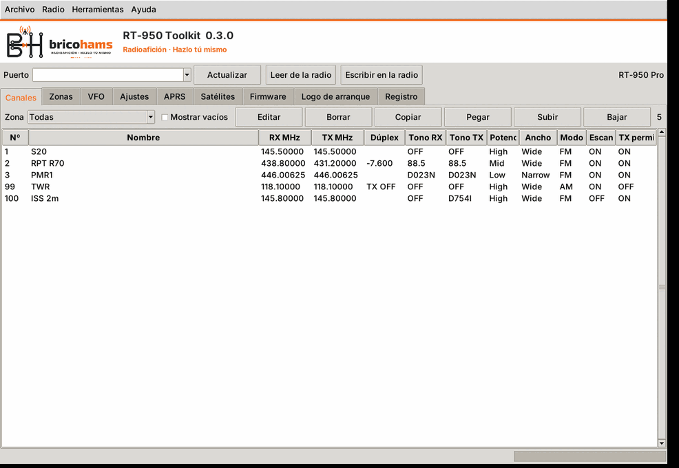
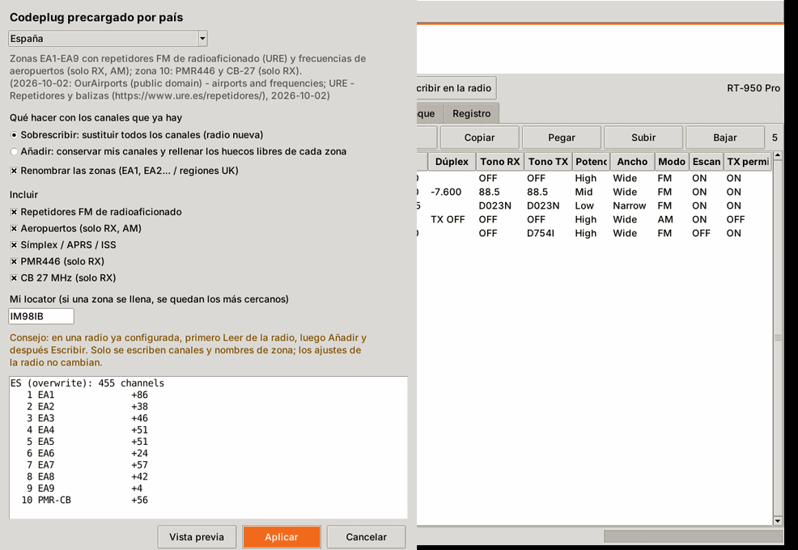
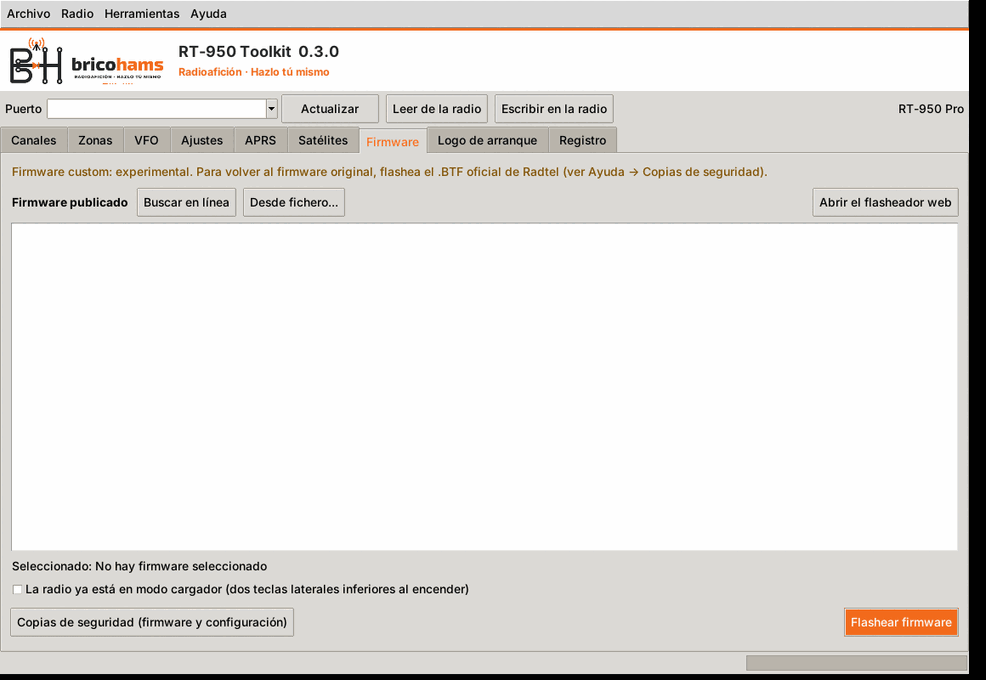
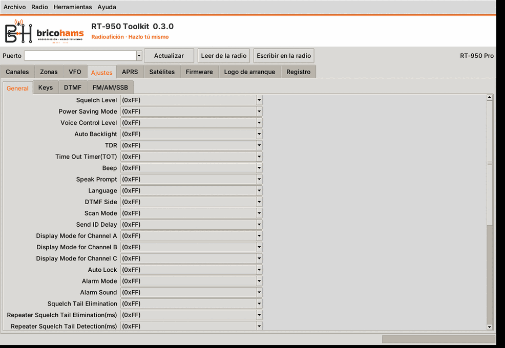
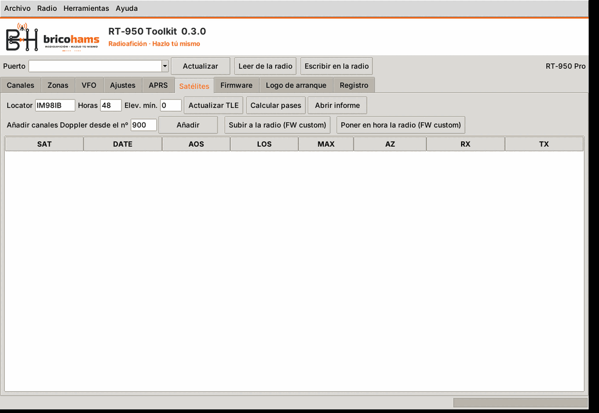

# BricoHams RT-950 Toolkit


*[English version](README.en.md)*

Aplicación de escritorio y de línea de comandos, para **Windows y Linux**,
que programa la Radtel **RT-950 / RT-950 Pro** por el cable de programación.
Sirve para radios con el **firmware original de Radtel** y para radios con el
**firmware custom** de este repositorio, y reúne en un solo programa:

- el editor de configuración (*codeplug*): canales, zonas, VFO, ajustes,
  DTMF, FM/AM/SSB y APRS;
- la herramienta de satélites: TLE, pases, canales Doppler y carga de la base
  de datos en la radio;
- la conversión y carga del logo de arranque.



## Descarga e instalación

### Instaladores y paquetes (recomendado)

En la página **Releases** del repositorio y en la
[web del proyecto](https://anatolbricoham.github.io/rt950pro-satellite-mode/):

| Sistema | Fichero | Instalación |
|---|---|---|
| Windows 10/11 x64 | `BricoHams-RT950-Toolkit-Setup-x.y.z.exe` | Instalador firmado por BricoHams (ver [firma y SmartScreen](../signing-and-packages/README.md)). También hay versión portable. |
| Debian / Ubuntu | `bricohams-rt950-toolkit_x.y.z_all.deb` | `sudo apt install ./bricohams-rt950-toolkit_x.y.z_all.deb` |
| Arch Linux | `bricohams-rt950-toolkit-x.y.z-1-any.pkg.tar.zst` | `sudo pacman -U bricohams-rt950-toolkit-*.pkg.tar.zst` |
| Otras distribuciones | `BricoHams-RT950-Toolkit-x.y.z-linux-x64` | `chmod +x` y ejecutar |
| Android | `BricoHams-RT950-Programmer-x.y.z.apk` | Ver [app de Android](../android/README.md) |

### Desde el código fuente

Requiere Python 3.9 o posterior con Tkinter.

```bash
pip install -r pc/requirements.txt      # pyserial, sgp4 (+ pillow, opcional)
python pc/run_toolkit.py                # aplicación de escritorio
python pc/run_toolkit.py --help         # ver también la sección CLI
```

En Linux, Tkinter va aparte en algunas distribuciones
(`sudo apt install python3-tk`) y el usuario necesita permiso sobre el puerto
serie: `sudo usermod -aG dialout $USER` y volver a iniciar la sesión.

### Cable

Se usa el cable USB de programación de la radio (conector tipo Kenwood). En
Windows hay que instalar el controlador del convertidor USB-serie del cable;
el puerto aparece como `COMx`. En Linux aparece como `/dev/ttyUSB0` o
`/dev/ttyACM0`.

## Novedades de la versión 0.3.0

- **Marca BricoHams** en la ventana, el icono, el instalador, la web y la pantalla de arranque del firmware custom.
- **Ayuda** (F1): manual HTML en español e inglés, guía de copias de seguridad y aviso de responsabilidad (se acepta en el primer uso).
- **Codeplugs por país** (España y Reino Unido): **Herramientas → Codeplug por país…**, ver [la documentación](../country-codeplugs/README.md).
- **Firmware**: pestaña **Firmware** para flashear el firmware publicado o un `.BTF` propio, y [flasheador web](../firmware-flashing/README.md).
- **Escritura segura**: un codeplug que no se ha leído de la radio solo escribe lo que se ha cambiado, mezclado con lo que ya tiene la radio.

| Codeplug por país | Firmware |
|---|---|
|  |  |

## Uso básico

1. Conecta el cable, enciende la radio y elige el **Puerto** (botón
   **Actualizar** para volver a buscar).
2. **Leer de la radio.** El programa detecta solo si la radio lleva el
   firmware original o el custom. Al terminar guarda una copia de seguridad.
3. Edita lo que necesites en las pestañas.
4. **Escribir en la radio.** Antes de escribir vuelve a leer la radio y guarda
   otra copia. Después de escribir lee de nuevo cada bloque y lo compara
   (verificación). Si algo no coincide, avisa con la dirección exacta.
5. Guarda tu configuración con **Archivo → Guardar** (formato `.rt950`).

Las copias de seguridad están en `%APPDATA%\BricoHamsRT950\backups` (Windows) o
en `~/.config/BricoHamsRT950/backups` (Linux). **Radio → Restaurar una copia**
escribe una de ellas en la radio.

El programa solo cambia los bytes de los campos que editas. Todo lo demás que
leyó de la radio (bits desconocidos, código FHSS, bytes reservados) se vuelve
a escribir tal cual.

## Pestañas

| Pestaña | Qué contiene |
|---|---|
| **Canales** | 990 canales en 10 zonas de 99. Filtro por zona, mostrar vacíos, editar (doble clic), borrar, copiar/pegar, subir/bajar. Diálogo con nombre (GBK, 12 bytes), RX/TX, tonos CTCSS/DCS (normal e invertido), potencia, ancho, modo RX (FM/AM), TX permitida, escaneo, bloqueo por ocupado, scrambler 1–8, cifrado DCP1–3, código de señalización 1–16 y PTT-ID. |
| **Zonas** | Nombre de las 10 zonas (16 bytes). |
| **VFO** | Frecuencia y desplazamiento de VFO A, B y C. El resto de opciones del VFO se muestra en solo lectura (ver D-34). |
| **Ajustes** | Generales, Teclas, DTMF (ID de radio y códigos) y FM/AM/SSB (memorias, nombres, desplazamiento BFO de SSB). Salen del fichero de modelo del fabricante: 131 opciones de selección, 58 textos, 64 valores numéricos y 16 códigos DTMF. |
| **APRS** | Indicativo y SSID, rutas, mensaje de baliza, símbolo, temporización, unidades, etc. |
| **Satélites** | Locator, horas y elevación mínima; **Actualizar TLE**, **Calcular pases**, **Añadir canales Doppler** al codeplug a partir del número indicado, **Abrir informe** y, con el firmware custom, **Subir a la radio** y **Poner en hora**. |
| **Firmware** | Flashear el firmware publicado (se comprueba el SHA-256) o un `.BTF` propio; modo cargador para recuperar una radio. |
| **Logo de arranque** | Convierte una imagen a 240×320, la exporta como BMP y, con el firmware custom, la sube a la radio. |
| **Registro** | Mensajes y errores de cada operación. |



## Ficheros

| Menú Archivo | Formato | Notas |
|---|---|---|
| Abrir / Guardar | `.rt950` | Formato propio (JSON con los bloques de memoria en base64). Sin pérdidas. |
| Abrir / Guardar como `.dat` del CPS | `.dat` | Fichero del programa oficial de Radtel. Para guardar se usa como plantilla un `.dat` existente (el que abriste o uno que elijas), en el que se cambian los campos. |
| Importar / Exportar CSV (nativo) | CSV | Una columna por campo del canal. Sin pérdidas. |
| Importar / Exportar CSV de CHIRP | CSV | Formato de intercambio de CHIRP y RepeaterBook. Al importar se puede elegir el primer canal o usar la columna `Location`. |
| Importar / Exportar CSV de RT-950 Editor | CSV | Columnas `slot, rxFreq, txFreq, rxQT, …` del Editor de KK4OXN. Probado con sus plantillas y con `EU LPD and PMR Channels.csv`. |
| Importar / Exportar CSV de zonas | CSV | `zone, zone_name`, como la plantilla del Editor. |
| Importar / Exportar CSV FM/AM/SSB | CSV | `index, label, fmFreq, fmName, amFreq, amName, ssbFreq, ssbBandwidth, ssbBeatFreqOffset, ssbName`. Una celda vacía no cambia nada; `<blank>` borra el valor. |
| Importar / Exportar imagen binaria | `.bin` | Los bloques seguidos, para comparar con otras herramientas. |

**Herramientas → Añadir canales predefinidos**: PMR446 (solo RX), símplex
IARU Región 1 (2 m y 70 cm), marina (solo RX) y banda aérea en AM (solo RX).

## Satélites

La pestaña **Satélites** hace lo mismo que `tools/rt950_sat.py` (la
herramienta de línea de comandos del modo satélite):

- **Firmware original**: calcula los pases y añade al codeplug los canales
  Doppler en split (AOS, A2, TCA, L2, LOS y, para SO-50, el canal de armado).
  El informe HTML dice a qué hora pasar de un canal al siguiente.
- **Firmware custom**: además sube `satdb.bin` (TLE, frecuencias, pases y QTH)
  y pone en hora la radio. La radio calcula entonces la órbita y corrige el
  Doppler en tiempo real.

Ver [la documentación del modo satélite](../satellite/README.md).



## APRS

La pestaña APRS edita la configuración de la baliza. La mensajería de texto
con acuse de recibo funciona **en el firmware custom** (menú APRS Set →
Messages); el firmware original solo tiene el mensaje fijo de la baliza. Ver
[mensajería APRS](../aprs-messaging/README.md).

## Línea de comandos

```bash
RT950Toolkit                                    # aplicación de escritorio
RT950Toolkit read  --port COM5 -o radio.rt950   # leer (y guardar copia)
RT950Toolkit write --port COM5 radio.rt950      # escribir (copia + verificación)
RT950Toolkit write --port COM5 radio.rt950 --channels-only
RT950Toolkit info radio.rt950                   # resumen de canales
RT950Toolkit export-chirp radio.rt950 canales.csv
RT950Toolkit import-chirp radio.rt950 canales.csv --start 100 -o nuevo.rt950
RT950Toolkit sat all --locator IM98IB [--port COM5]   # herramienta de satélites
```

Desde el código fuente, `RT950Toolkit` equivale a `python pc/run_toolkit.py`.

## Probar sin radio

`pc/tests/oem_emulator.py` emula el puerto de programación de una RT-950 Pro
con firmware original sobre un pseudo-terminal (solo Linux):

```bash
python pc/tests/oem_emulator.py
# Emulated RT-950 Pro on /dev/pts/5
```

Escribe esa ruta en **Puerto** y lee o escribe como con una radio real.

## Comparación con RT-950/950Pro Editor

| Función del Editor | RT-950 Toolkit |
|---|---|
| Leer, escribir y verificar por cable | Sí (misma secuencia de bloques; ver [PROTOCOL.md](PROTOCOL.md)) |
| Canales, zonas, VFO, ajustes, DTMF, FM/AM/SSB, APRS | Sí (opciones de VFO en solo lectura) |
| Abrir y guardar `.dat` | Sí (guardar usa un `.dat` como plantilla) |
| CSV de canales, zonas y FM/AM/SSB | Sí, más CHIRP y CSV nativo |
| Configuraciones predefinidas | Sí (PMR446, IARU R1, marina, aérea) |
| Copia de seguridad | Sí, automática antes de cada escritura |
| Programación por Bluetooth (BLE) | No |
| Búsqueda en RepeaterBook / RadioReference | No (se puede importar su CSV en formato CHIRP) |
| Carga del logo de arranque con el firmware original | No (sí con el firmware custom) |
| Windows | Sí |
| Linux | Sí |
| Satélites (TLE, pases, Doppler, carga en la radio) | Sí |
| Firmware custom (protocolo A5) | Sí |

## Estado

- El protocolo y las codificaciones se han contrastado con el Editor, que
  está probado con radios reales, y con el fichero de modelo del fabricante.
  Las pruebas automáticas cubren todo con un emulador de la radio, pero
  **este programa todavía no se ha probado con una radio física**. Guarda la
  copia de seguridad que hace al leer y comprueba el resultado.
- Ver [DESIGN_DECISIONS.md](../satellite/DESIGN_DECISIONS.md) (D-29 a D-38) y
  [TESTING.md](../satellite/TESTING.md).

## Créditos

- **RT-950/950Pro Editor**, de KK4OXN (licencia MIT): referencia para
  verificar el protocolo, las codificaciones de tonos y textos, el plan de
  bloques y el formato `.dat`. No se ha copiado su código.
- El fichero de modelo de Radtel (`rt950pro_schema.json`) describe las
  direcciones y opciones de los ajustes.
